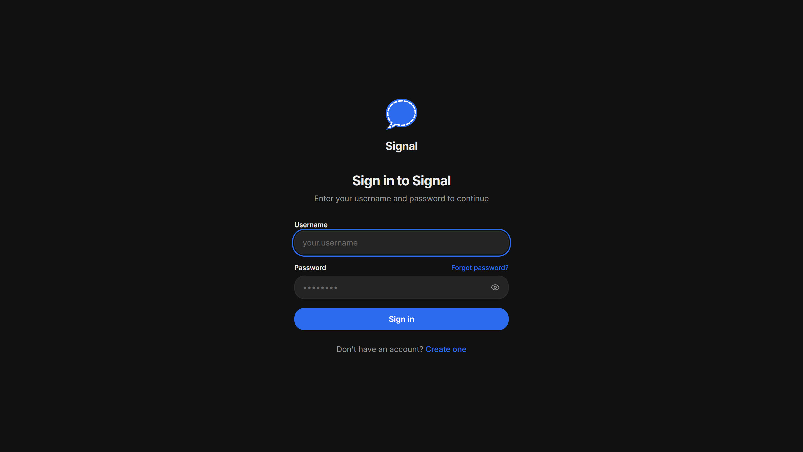
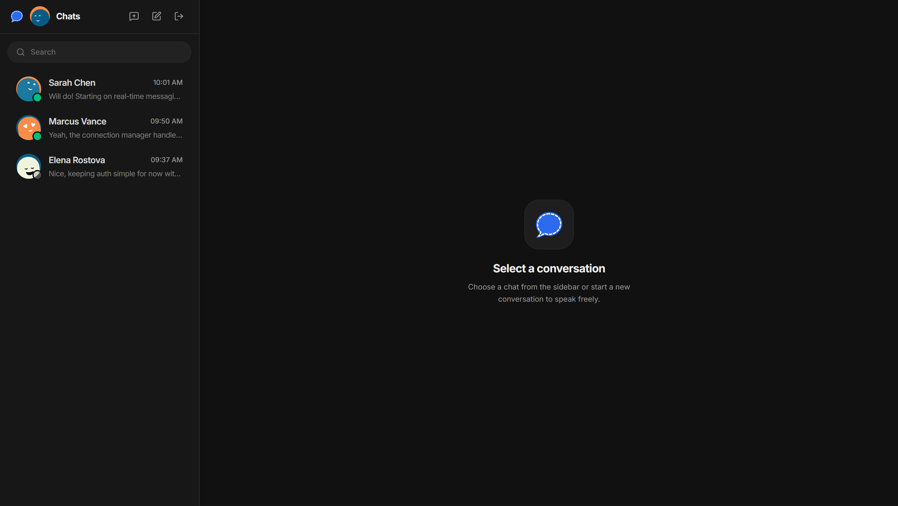
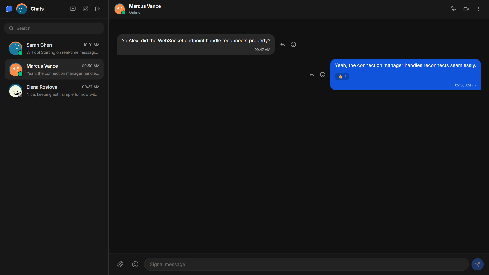
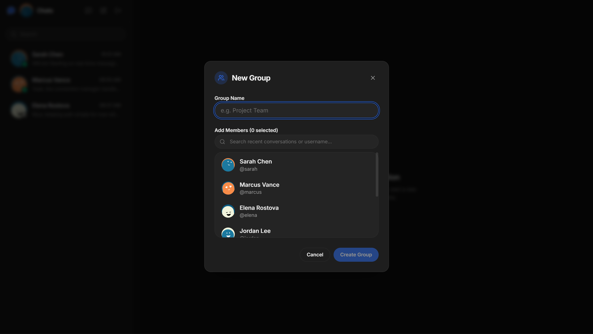

<div align="center">

# Signal Clone

**A desktop messaging application inspired by Signal, built with Next.js and FastAPI.**

```
Next.js
   │
REST / WebSocket
   │
FastAPI
   │
SQLAlchemy
   │
SQLite / PostgreSQL
```

</div>

---

## Features

- **1:1 & Group Messaging**: Real-time message delivery over WebSockets with fallback REST support.
- **Message Status Receipts**: Sent (`✓`), delivered (`✓✓`), and read status tracking.
- **Emoji Reactions & Quoted Replies**: Attach emoji reactions or reply to specific messages in context.
- **Media & File Attachments**: Image thumbnail previews with full-screen lightbox modal viewer.
- **Automatic Contact Creation**: Contacts are created automatically upon initial message exchange or group inclusion.
- **Account Recovery & Validation**: Step-by-step registration with real-time username availability checks, password confirmation, and OTP verification flow.

---

## Tech Stack

### Frontend
- **Framework**: Next.js 16 (App Router) + React 19
- **State Management**: Zustand v5 (Auth/Socket), TanStack Query v5 (Server state)
- **Styling**: Tailwind CSS v4, Framer Motion, Lucide Icons
- **Form & Validation**: React Hook Form + Zod

### Backend
- **Framework**: FastAPI (Python 3.11+)
- **Database**: SQLAlchemy 2.0 ORM + SQLite (Alembic migrations)
- **Real-Time**: WebSockets
- **Authentication**: Passlib (Bcrypt) + Python-Jose (JWT)

---

## Project Structure

```
signal/
├── backend/
│   ├── main.py                  # Application entry point & CORS configuration
│   ├── database.py              # SQLAlchemy engine & session factory
│   ├── core/                    # Security, auth dependencies, configuration
│   ├── models/                  # Database models (User, Conversation, Message, Contact)
│   ├── routers/                 # API endpoint handlers (Auth, Messages, Users, Conversations)
│   ├── services/                # Business logic & data manipulation layer
│   └── websocket/               # Connection manager & WebSocket event handlers
└── frontend/
    └── src/
        ├── app/                 # Next.js App Router pages
        ├── features/            # Feature-scoped components & logic (auth, conversations, messages, groups)
        ├── services/            # API client wrapper
        └── store/               # Zustand global state stores
```

---

## Local Setup

### Prerequisites
- Node.js 20+
- Python 3.11+
- pnpm (`npm install -g pnpm`)

### 1. Backend Setup

```bash
cd backend

# Create virtual environment
python -m venv .venv

# Activate virtual environment
# Windows:
.venv\Scripts\activate
# Linux/macOS:
source .venv/bin/activate

# Install dependencies
pip install -r requirements.txt

# Start API server
uvicorn main:app --reload --port 8000
```
The backend API server will start at `http://localhost:8000`.

### 2. Frontend Setup

```bash
cd frontend

# Install dependencies
pnpm install

# Start development server
pnpm dev
```
Open `http://localhost:3000` in your browser.

---

## Environment Variables

### Backend (`backend/.env`)

| Variable | Default | Description |
|---|---|---|
| `DATABASE_URL` | `sqlite:///./signal.db` | Database connection string |
| `SECRET_KEY` | `your_secret_key...` | Secret key used for signing JWTs |
| `ALLOWED_ORIGINS` | `["http://localhost:3000"]` | Allowed origins for CORS |

### Frontend (`frontend/.env.local`)

| Variable | Default | Description |
|---|---|---|
| `NEXT_PUBLIC_API_URL` | `http://localhost:8000` | Backend API base URL |

---

## Implementation Notes

- **Authentication**: JWT tokens passed in authorization headers. Pre-flight username availability checks run on step 0 during registration via `/auth/check-username`. Demo OTP code for verification is `123456`.
- **WebSockets**: Maintains client connections by `user_id`. Handles real-time message broadcasting, typing state, read receipt updates, and reaction events.
- **Media Uploads**: File attachments are saved to local backend storage (`/uploads/`) and rendered with relative backend URLs.

---

## Screenshots

<table>
  <tr>
    <td align="center"><b>Login</b></td>
    <td align="center"><b>Main Chat</b></td>
  </tr>
  <tr>
    <td></td>
    <td></td>
  </tr>
  <tr>
    <td align="center"><b>Conversation</b></td>
    <td align="center"><b>Create Group</b></td>
  </tr>
  <tr>
    <td></td>
    <td></td>
  </tr>
</table>

---
